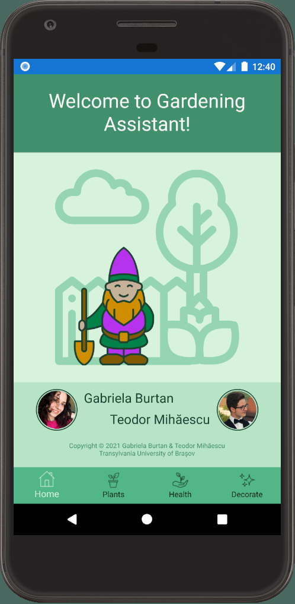
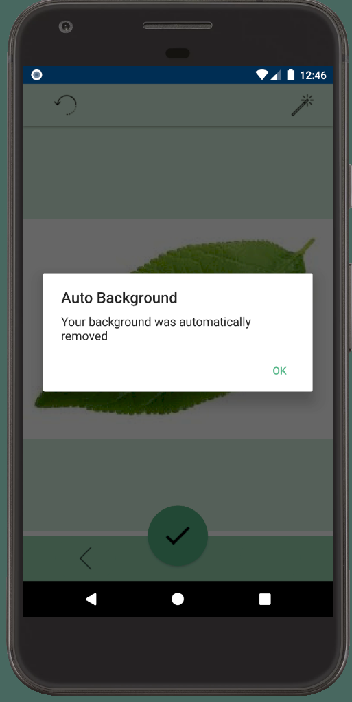
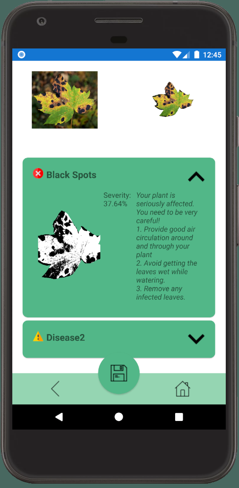
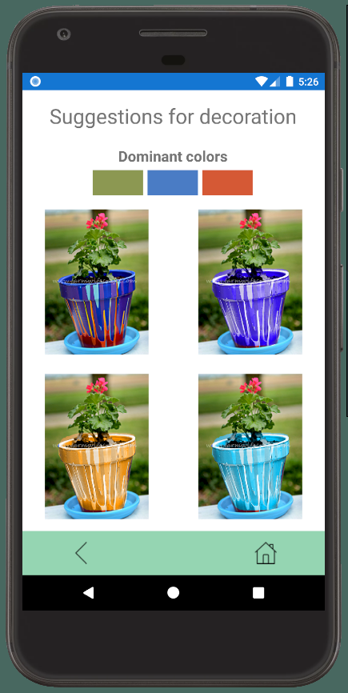
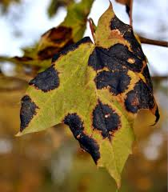
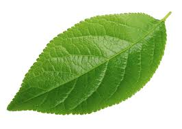
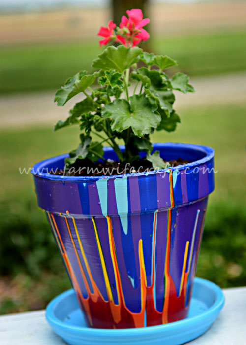
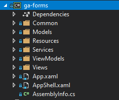
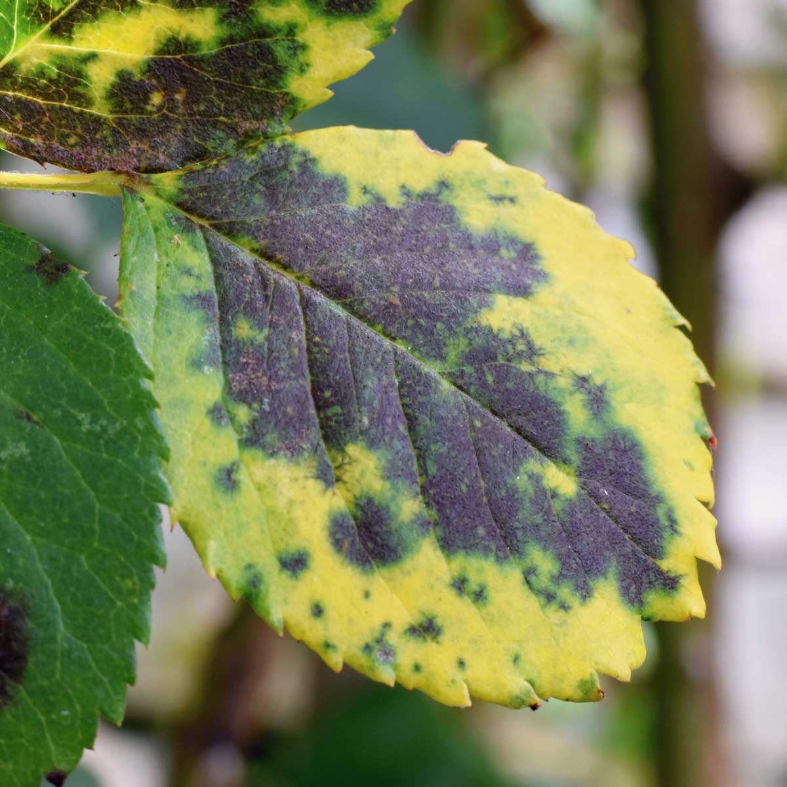

 

> For the English version see: [README (EN)](README.md)

# Informații Generale

Gardening Assistant este un proiect realizat de Gabriela Burtan și Teodor Mihăescu, în cadrul Facultății de Matematică-Informatică, la Universitatea Transilvania din Brașov, pentru materiile de Dezvoltare a Aplicațiilor Mobile și Procesare de Imagini Digitale.

Aplicația are ca scop realizarea unui asistent mobil de întreținere și înfrumusețare a grădinii. Aplicația dispune de funcționalități precum: detecția de boli la plante, sugestii de decorare a grădinii, bazate pe datele analizate.

Aplicația este dezvoltată în framework-ul Xamarin Forms utilizând limbajul de programare C# (ce interpretează în limbaj Java și compilează ulterior proiectul Android).

> Pentru mai multe detalii puteți vizualiza:
> [Videoclipul de prezentare al aplicației](https://youtu.be/5G7V_HSD6M0)

## Interfața grafică

Interfața grafică constă din următoarele view-uri:

| Main View| Camera View| Selection View|
|:-:|:-:|:-:|
| **Processing  Selection**| **Auto-Background Dialog Box**| **Healthy Leaf Results**|
| **Blackspots Leaf Results**| **Decorate View**| **Plants View (dummy)**|

## Imagini utilizate

Pentru a testa aplicația puteți utiliza următoarele imagini:

| Blackspots 1| Blackspots 2| Blackspots 3|
|:-:|:-:|:-:|
| **Healthy 1**| **Healthy 2**| **Healthy 3**|
| **Decorate 1**| **Decorate 2**| **Decorate 3**|

Folderul cu imagini, este disponibil [aici](https://drive.google.com/drive/folders/1Ab48aXJ17utoXJEorPpaw2ZbpZKiQxjn?usp=sharing)

## Structura proiectului

Soluția Gardening Assistant este structurată astfel:

La rădăcina soluției se afla 3 proiecte: Xamarin.Forms, Xamarin.Android și Xamarin.iOS
 

 
Xamarin.Forms este proiectul principal, de pe care se interpretează și compilează ulterior și proiectele native (momentan doar Android).

Proiectul de Xamarin.Forms este structurat astfel:
 

 
Folderele proiectului au următoarele funcționalități:
- **Common**: Aici se află toate clasele share-uite ce au mai mult de o dependință în proiect, precum containerul de Dependency Injection, enum-uri, constante, etc.
- **Models**: Aici se află modelele proiectului, clasele care se ocupă de transmiterea structurală a datelor, precum și algoritmii de procesare de imagine și pipeline-ul aferent
- **Resources**: Aici se află diverse resurse statice de tip date necesare proiectului
- **Services**: Aici se află serviciile, clasele responsabile de business logic-ul proiectului, precum ImageManagerService, DialogBoxService, etc.
- **ViewModels**: Aici se află clasele responsabile de logica view-urilor precu și datele bind-uite de acestea
- **Views**: Aici se află view-urile, paginile de UI afișate utilizatorului
- **App.xml**: Aici se află fișierul principal de configurație a view-urilor aplicației
- **AppShell.xaml**: Aici se află layout-ul responsabil de navigarea între pagini, deoarece proiectul implementează ShellNavigation, componentă a Xamarin.Forms-ului
- **AssemblyInfo.cs**: Aici se află diverse informații despre aplicație, precum versiunea, numele, permisiunile. Dar fișierul este opțional, aceste setări putând fi modificate și în fișierul de manifest al proiectului nativ (Android)

## Posibilități de dezvoltare
- Implementarea funcționalităților de stocare a datelor despre plante, creare de noi plante, hint-uri și detalii despre plantele curente
- Persistența datelor utilizând un cont de utilizator și baze de date
- Funcționalitate de generare a graficelor și statisticilor specifice unei anumite plante (ex: evoluția sănătății acesteia de-a lungul timpului)
- Detecții pentru diverse boli (vezi [10 Common Plant Diseases (and How to Treat Them)](https://www.familyhandyman.com/list/most-common-plant-diseases/))
- Algoritmi de detectare a luminozității necesare speciei de plante deținute
- Algoritmi de Machine Learning pentru detecția speciei plantelor
- Optimizări de filtrare, denoisification și alte proceduri similare de pre-procesare
- Optimizări aduse algoritmilor de procesare de imagini existenți, precum și celor de selecție și manipulare a imaginilor
- Procesări asincrone
- Rezolvarea diverselor excepții sau bug-uri netratate și afișarea căsuțelor de dialog unde este necesar

## Tehnologii și dependințe

Proiectul este realizat folosind [Xamarin Forms](https://github.com/xamarin/Xamarin.Forms), cu proiect atașat de Xamarin.Android.

Pentru partea de selectare, manipulare a bitmap-urilor si implementarea funcționalităților si algoritmilor legați de procesarea de imagini, am folosit framework-ul [SkiaSharp](https://github.com/mono/SkiaSharp).

Pentru acces la camera si funcționalitatea de a uploada, captura si transmite poze, am folosit modulul de cameră din framework-ul [XamarinCommunityToolkit](https://github.com/xamarin/XamarinCommunityToolkit).

Pentru message box-urile de alertă, loading, etc. am folosit framework-ul [Acr.UserDialogs](https://github.com/aritchie/userdialogs).

Pentru funcționalitatea de dependency injection, folosită în cadrul implementării serviciilor, am folosit framework-ul [Microsoft.Extensions.DependencyInjection](https://github.com/aspnet/DependencyInjection).

Ca temă și stil vizual am folosit Material Design, disponibil direct ca pachet nuget pentru Xamarin: [Xamarin.Forms.Visual.Material](https://docs.microsoft.com/en-us/xamarin/xamarin-forms/user-interface/visual/material-visual)

## Funcționalitatea de eliminare a background-ului

Pentru a elimina background-ul și implicit a lua în considerare doar zona de interes (selectată manual de utilizator, sau automat de către algoritmul de automat de eliminare a background-ului) am utilizat framework-ul SkiaSharp și am implementat un algoritm care:

1. reacționează la evenimentele ecranului touch-screen

2. creează liste de puncte, ce își sincronizează coordonatele în funcție de pixelii imaginii

3. odată ce selecția este făcută, se generează o imagine binarizată, ce are negru pe fundal și alb pe zona selectată

4. apoi această imagine este suprapusă imaginii originale, generându-se o nouă imagine ce are canalul alpha egal cu 0 (transparență maximă) la coordonatele în care imaginea binarizată este neagră, iar unde imaginea binarizată este albă, imaginea nou formată va prelua pixelii imaginii originale

5. astfel ajungem la obținerea unei imagini ce are fundalul transparent și zona de interes selectată de pe imaginea originală.

Mai jos poate fi observat procesul menționat:

| Imaginea  originală| Selecția  utilizatorului| Imaginea binarizată| Imaginea rezultată|
|:-:|:-:|:-:|:-:|

## Procesare de Imagini Digitale

Pentru partea de procesare de imagine am implementat diferiți algoritmi cum ar fi:

- Filtru Gaussian

- Filtru Median

- Filtru Mean

- Conversia RGB - HSV și invers

- Conversie din RGB în Grayscale

- Distanța Euclidiană între 2 culori

- Calcul histograma Hue și extragerea valorii Hue maxime

- Algoritm Otsu pentru binarizare

- Algoritm de segmentare a culorii pentru background removal

- Algoritm KMeansClustering pentru detectarea primelor 3 culori predominante

- Algoritm pentru calculul culorilor complementare

 
Dintre algoritmii enumerați mai sus am folosit:

- Conversia RGB - HSV și invers

- Conversie din RGB în Grayscale

- Distanța Euclidiană între 2 culori

- Algoritm Otsu pentru binarizare

- Algoritm de segmentare a culorii pentru background removal

- Algoritm KMeansClustering pentru detectarea primelor 3 culori predominante

- Algoritm pentru calculul culorilor complementare

## Link-uri auxiliare

- [Trello Board](https://trello.com/b/ncIVblHG/gardening-assistant)

- [Activity Journal](https://docs.google.com/document/d/1hEqILjdCqo6puv_jpFp1cqYhIiZxR2ykwIf-nIAsJfE/edit?usp=sharing)

- [Concept Diagrams - Image Processing](https://gardening-assistant-concepts.netlify.app/ip-concept.html)

- [Concept Diagrams - UX/UI](https://gardening-assistant-concepts.netlify.app/uxui-concept.html)

- [Documentation papers used](https://drive.google.com/drive/folders/1HV50YQ13YmZOf3d0m_IiwAi-vsUI-Xon?usp=sharing)

- [Image Resources Folder](https://drive.google.com/drive/folders/1Ab48aXJ17utoXJEorPpaw2ZbpZKiQxjn?usp=sharing)
