 

> Pentru versiunea în română vezi: [README (RO)](README-RO.md)

# General Presentation

Gardening Assistant is a project made by Gabriela Burtan and Teodor Mihăescu in the 3rd
year of Computer Science College from Transylvania University of Brasov for Mobile Applications Development and Digital Image Processing subjects.

The application is a mobile assistant for maintenance and embellishment of the garden. It has the following functionalities: disease detection of plants, suggestions for garden decoration based on analyzed data.

The application is developed in Xamarin Forms Framework using C# (which interprets the project in Java and then compiles the native Android project).

> For more details you can watch:
> [Gardening Assistant - Demo video](https://youtu.be/5G7V_HSD6M0)

## User Interface

The graphic interface consist of the following views:

| Main View|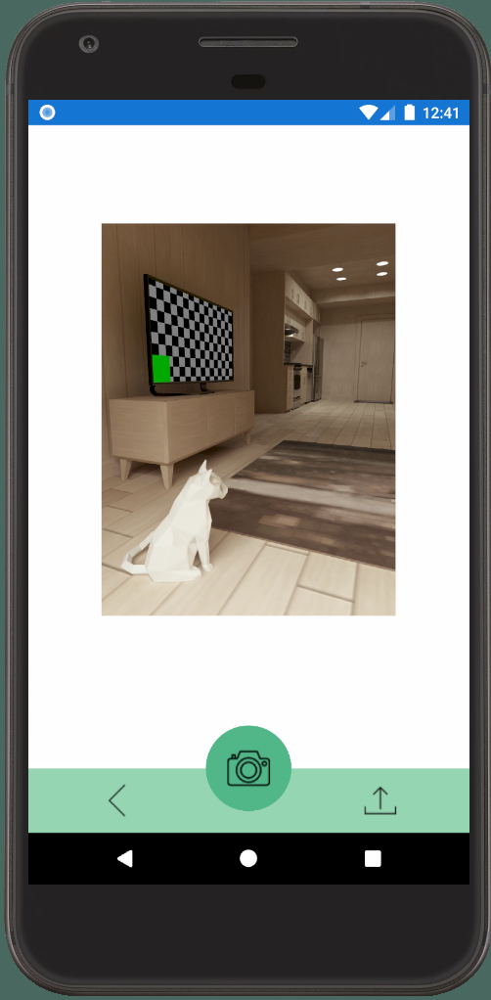 Camera View|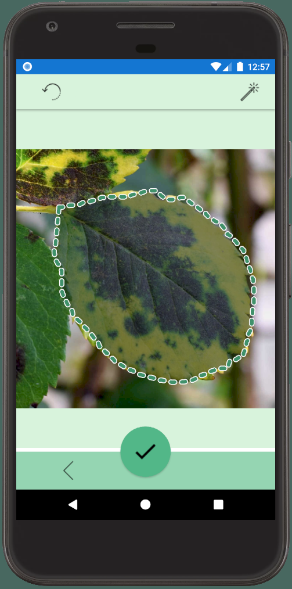 Selection View|
|:-:|:-:|:-:|
|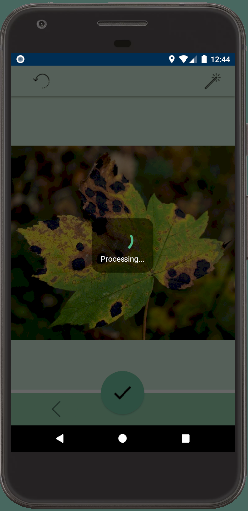 **Processing  Selection**|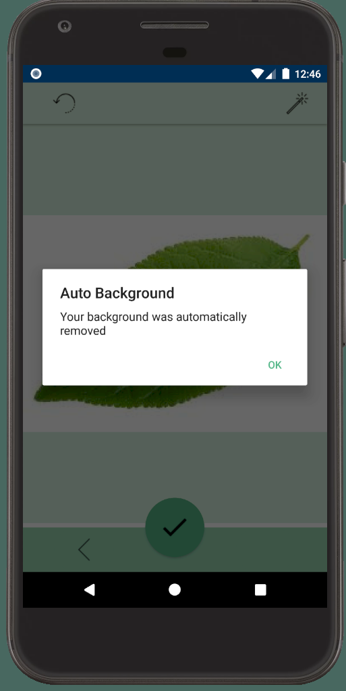 **Auto-Background Dialog Box**|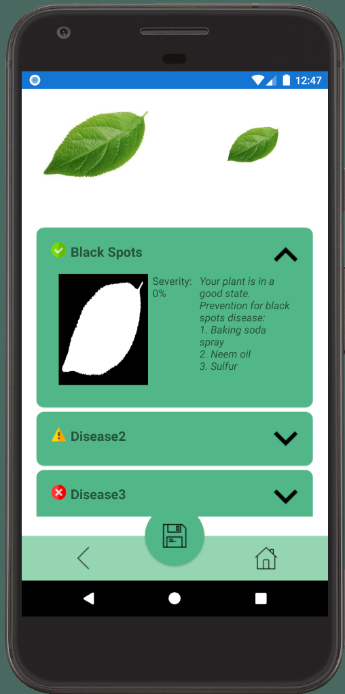 **Healthy Leaf Results**|
|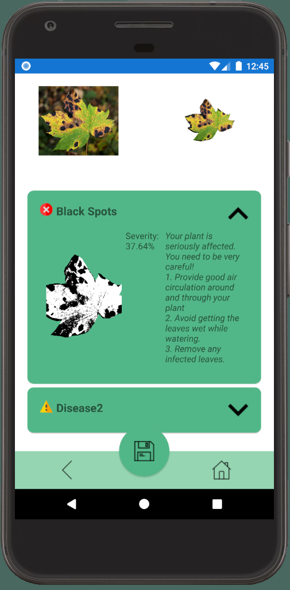 **Blackspots Leaf Results**|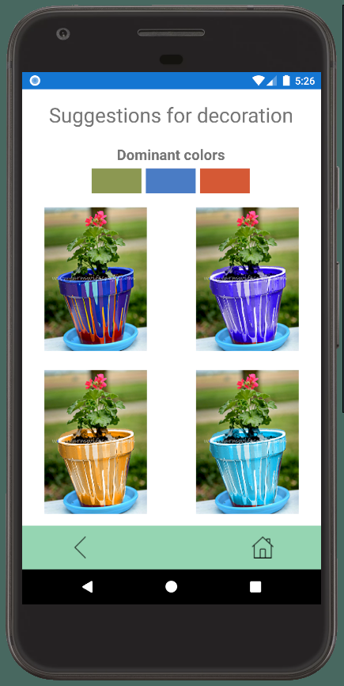 **Decorate View**|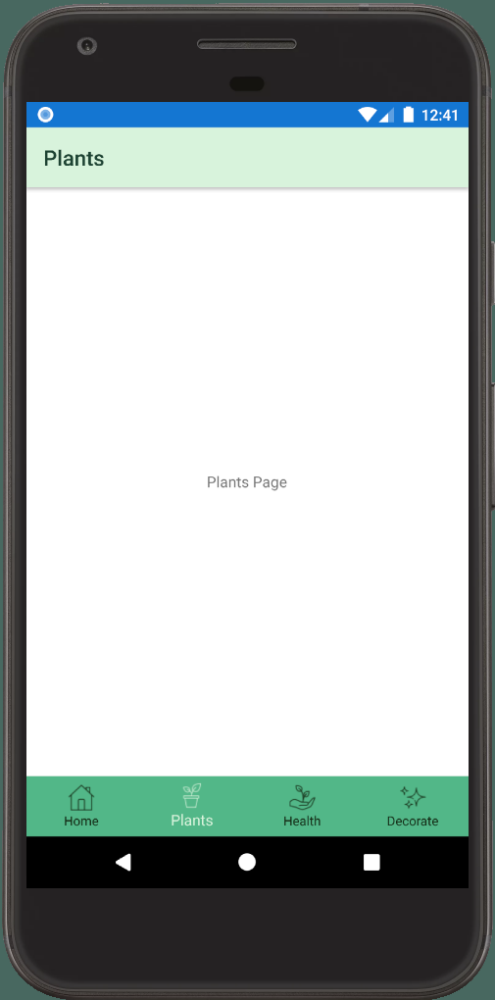 **Plants View (dummy)**|

## Images for testing

To test the application you can use the following images:

|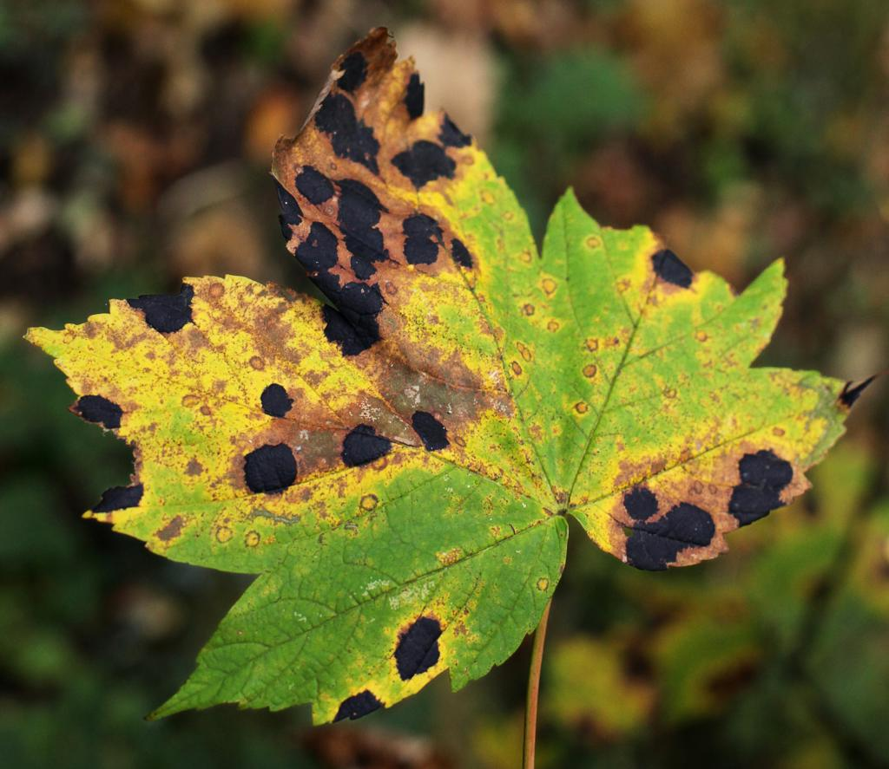 Blackspots 1|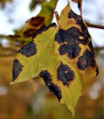 Blackspots 2|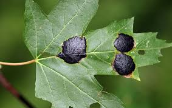 Blackspots 3|
|:-:|:-:|:-:|
|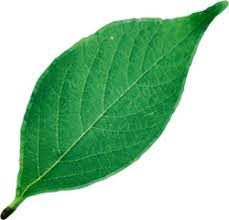 **Healthy 1**|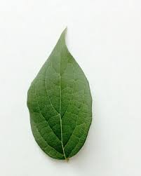 **Healthy 2**|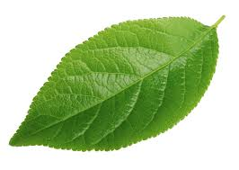 **Healthy 3**|
|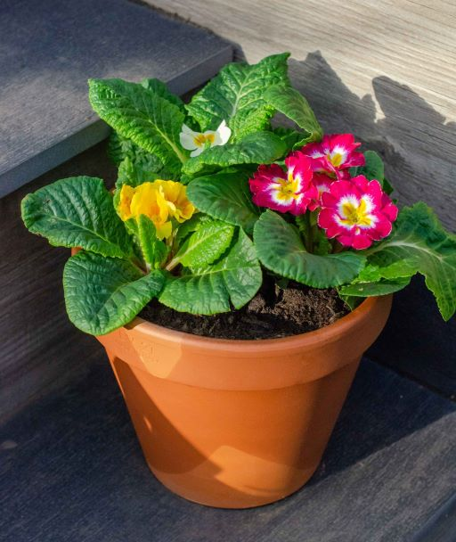 **Decorate 1**|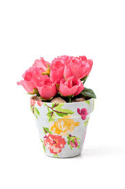 **Decorate 2**|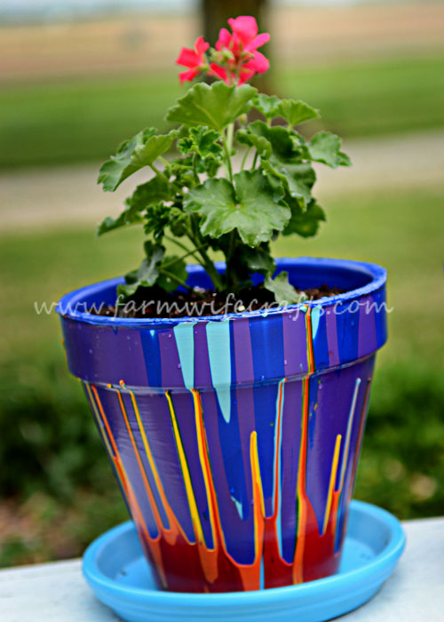 **Decorate 3**|

Images folder is available [here](https://drive.google.com/drive/folders/1Ab48aXJ17utoXJEorPpaw2ZbpZKiQxjn?usp=sharing)

## Project Structure

The project is structured as below.

There are three root projects: Xamarin.Forms, Xamarin.Android și Xamarin.iOS
 
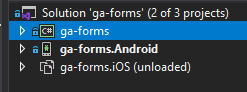
 
Xamarin.Forms is the main project.

Xamarin.Forms project is structured as below:
 
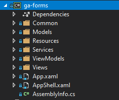
 
Project's folders have the following functionalities:
- **Common**: Here are all the shared classes which have more than one dependency in the project, like the Dependency Injection container, enums, constants, etc.
- **Models**: Here are project's models, classes which handle structural transfer of data, and also image processing algorithms and their pipeline
- **Resources**: Here are some static resources
- **Services**: Here are services, classes which handle the business logic of the project like ImageManagerService, DialogBoxService, etc.
- **ViewModels**: Here are classes responsible with views logic and the bounded data 
- **Views**: Here are the views, UI pages 
- **App.xml**: Here is the main configuration file of the views
- **AppShell.xaml**: Here is the navigation layout responsible with navigation through pages because the project implements Shell.Navigation
- **AssemblyInfo.cs**: Here is information about the application, like: version, name, permissions. 

## Future improvements
- Implementation of functionalities for storage of plants data, creation of new plants, hints and details about current plants
- Data persistence using user account and data base
- Functionality for graphical schema generation and for specific statistics of a plant (health improvement)
- Detection of multiple diseases (see [10 Common Plant Diseases (and How to Treat Them)](https://www.familyhandyman.com/list/most-common-plant-diseases/))
- Algorithms for detection of brightness
- Machine learning algorithms for specie recognition
- Optimizations for filtering, denoisification and another pre-processing procedures
- Optimizations for image processing algorithms and selection algorithms
- Asynchronous processes
- Solving unhandled exceptions or bugs and displaying dialog box where is necessary

## Technologies and dependencies

The project is made using [Xamarin Forms](https://github.com/xamarin/Xamarin.Forms), with an Xamarin.Android project attached.

For selection part, bitmap manipulation and functionalities of image processing algorithms we used SkiaSharp.
For camera access and upload functionality we used camera module from XamarinCommunityToolkit framework.

For alerts and loading message box we used [Acr.UserDialogs](https://github.com/aritchie/userdialogs).

For dependency injection we used [Microsoft.Extensions.DependencyInjection](https://github.com/aspnet/DependencyInjection)..

For theme and visual style we used Material Design, available on [Xamarin.Forms.Visual.Material](https://docs.microsoft.com/en-us/xamarin/xamarin-forms/user-interface/visual/material-visual)

## Background removal functionality

For background removal and selected area extraction (selected manually by the user or automatically by the background removal algorithm) we used SkiaSharp framework and we implemented an algorithm which:

1. is touch-screen responsive

2. creates lists of points which synchronize their coordinates with image pixels

3. after the selection is done, an binarized image with black pixels on background and white pixels on selected area is created

4. the generated image at point 3 is overlay on the original image; thus, a new image will be created: this image will have pixels with
alpha channel 0 where binarized image has black pixels and pixels from original image where the binarized image has white pixels

5. thus, we have an image which has transparent background selected area from original image

This process can be seen below:

|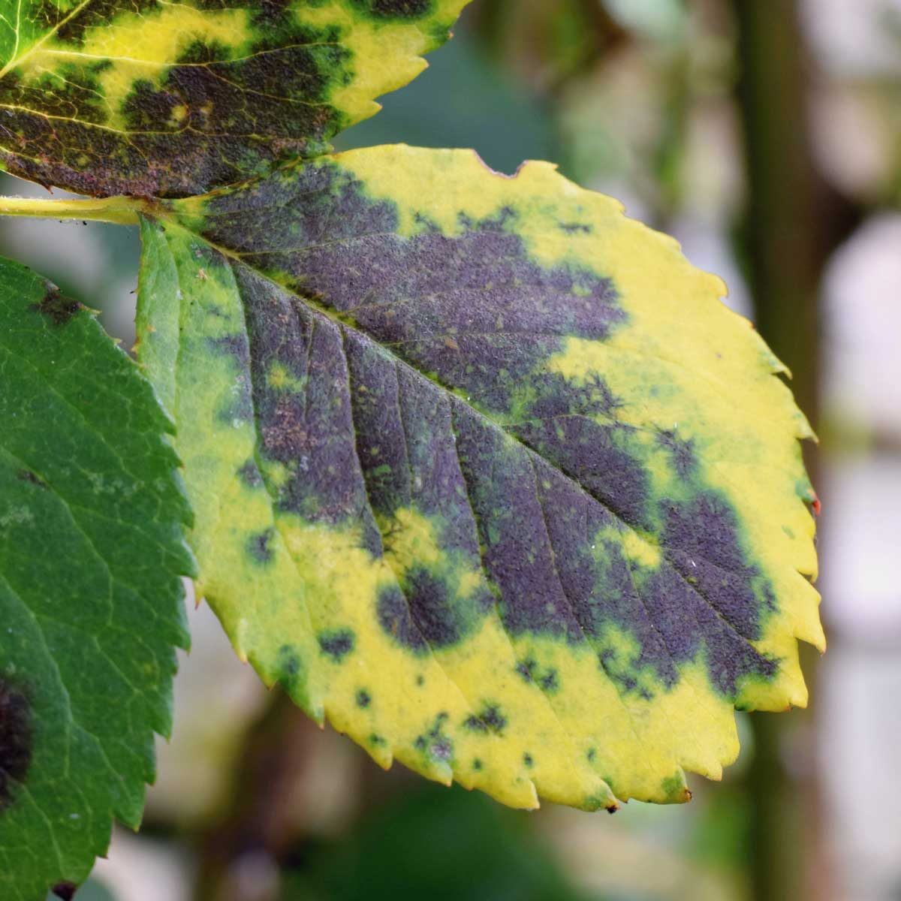 Original  image|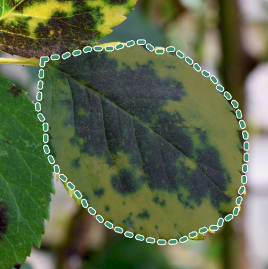 User  selection|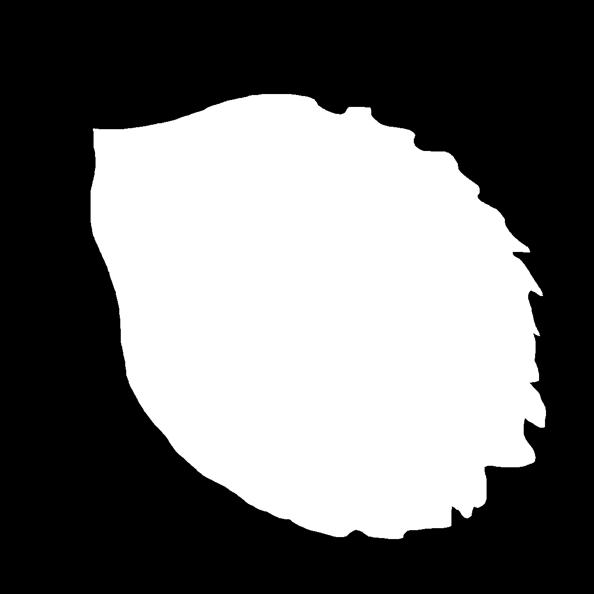 Binarized image|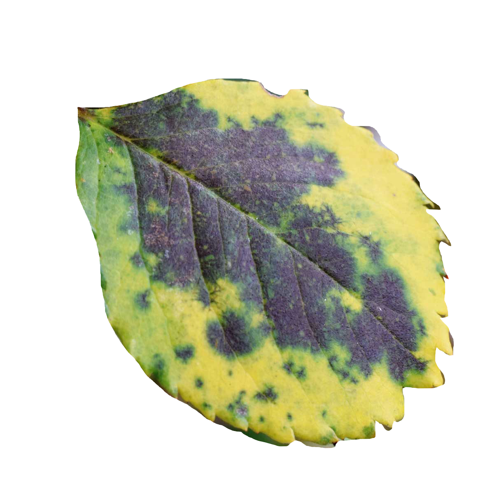 Result image|
|:-:|:-:|:-:|:-:|

## Image Processing

For image processing part we implemented the following algorithms:

- Gaussian Filter

- Median Filter

- Mean Filter

- RGB - HSV conversion

- HSV - RGB conversion

- RGB - Grayscale conversion

- Euclidian distance between 2 colors

- Computing of Hue histogram and extraction of the maximum Hue value

- Otsu algorithm for binarization

- Color segmentation algorithm for auto background removal

- KMeanClustering algorithm for detection of the first 3 predominant colors

- Algorithm for computing complementary colors

 
From the above algorithm we used:

- RGB - HSV conversion

- HSV - RGB conversion

- RGB - Grayscale conversion

- Euclidian distance between 2 colors

- Otsu algorithm for binarization

- Color segmentation algorithm for auto background removal

- KMeanClustering algorithm for detection of the first 3 predominant colors

- Algorithm for computing complementary colors

## Auxiliary Links

- [Trello Board](https://trello.com/b/ncIVblHG/gardening-assistant)

- [Activity Journal](https://docs.google.com/document/d/1hEqILjdCqo6puv_jpFp1cqYhIiZxR2ykwIf-nIAsJfE/edit?usp=sharing)

- [Concept Diagrams - Image Processing](https://gardening-assistant-concepts.netlify.app/ip-concept.html)

- [Concept Diagrams - UX/UI](https://gardening-assistant-concepts.netlify.app/uxui-concept.html)

- [Documentation papers used](https://drive.google.com/drive/folders/1HV50YQ13YmZOf3d0m_IiwAi-vsUI-Xon?usp=sharing)

- [Image Resources Folder](https://drive.google.com/drive/folders/1Ab48aXJ17utoXJEorPpaw2ZbpZKiQxjn?usp=sharing)
